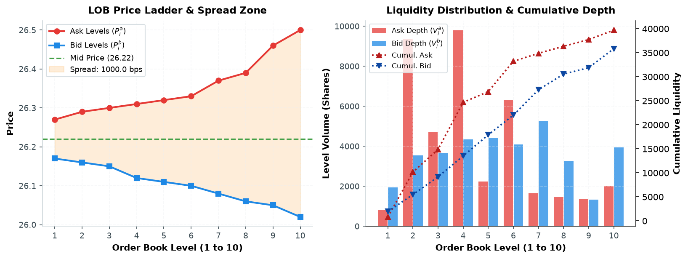
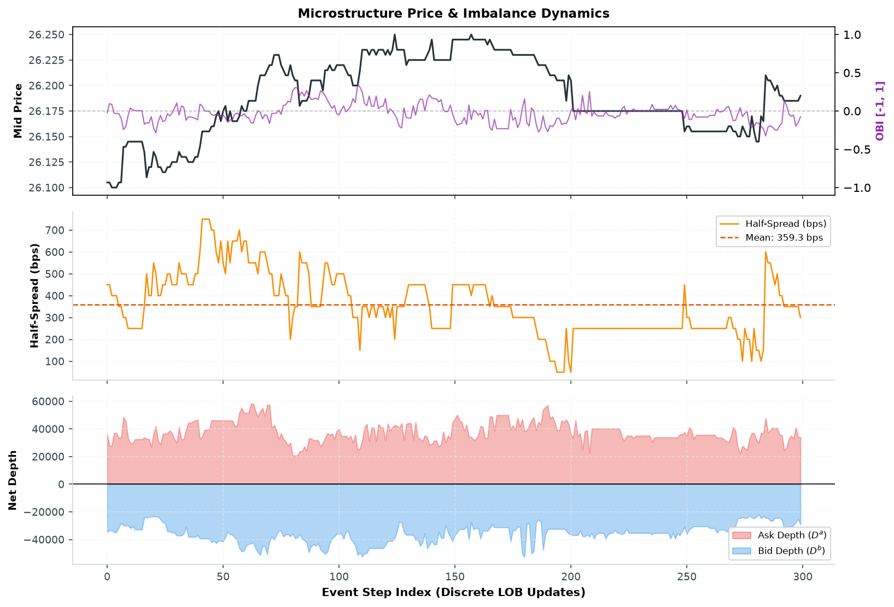
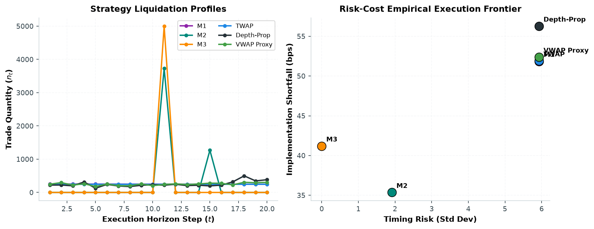
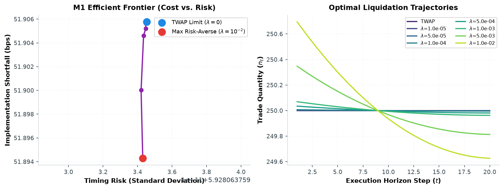
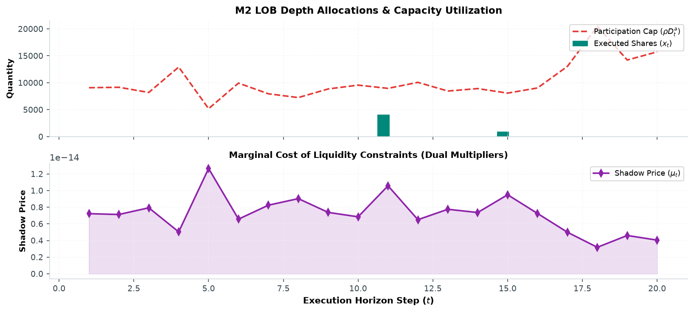
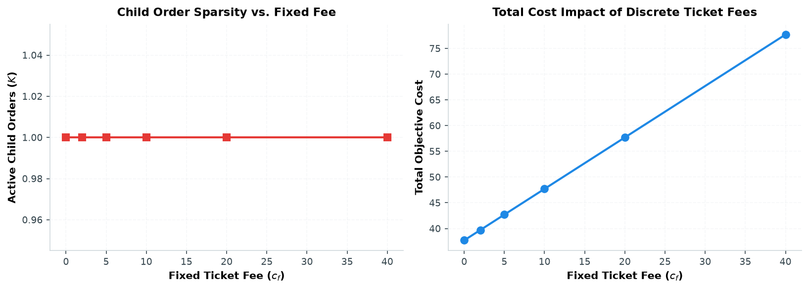
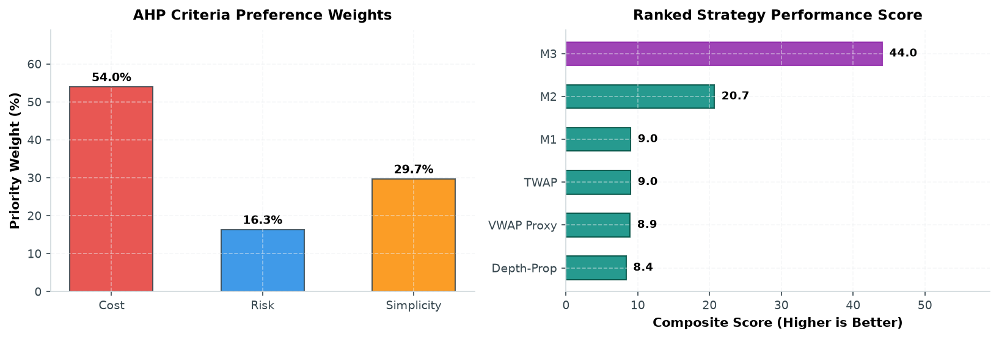

# ROTE: Comprehensive Model Execution & Microstructure Report
**Asset**: Kesko (KESBV) | **Test Period**: Day 8 (Held-out Out-of-Sample) | **Parent Order Size**: 5000 shares ($T=20$ slices)

---

## 1. Microstructure Environment
- **Average Half-Spread**: 10.22 bps
- **Average Ask Depth**: 50026 shares
- **Average Bid Depth**: 41737 shares
- **Order Book Imbalance (Mean)**: -0.0782
- **Short-Term Volatility**: 11.93 bps/period

---

## 2. Multi-Model Benchmark Comparison Table

| Model | Implementation Shortfall (bps) | Timing Risk (Std Dev) | Active Trades |
| :--- | :---: | :---: | :---: |
| **M1** | 51.85 | 5.93 | 20 |
| **M2** | 35.36 | 1.91 | 2 |
| **M3** | 41.20 | 0.00 | 1 |
| **TWAP** | 51.91 | 5.93 | 20 |
| **Depth-Prop** | 56.27 | 5.93 | 20 |
| **VWAP Proxy** | 52.38 | 5.93 | 20 |

---

## 3. Mathematical Optimization Deep Dive

### M1: Almgren-Chriss Mean-Variance Efficient Frontier

- As risk aversion parameter $\lambda$ increases from $0$ to $10^{-2}$, execution aggressively front-loads into early time steps, reducing timing variance at the cost of higher market impact.

### M2: Limit Order Book LP with Shadow Prices

- Shadow prices identify binding depth constraints where liquidity bottlenecks force the parent order to traverse deeper into the order book.

### M3: Fixed-Charge Mixed-Integer Program

- As fixed ticket fees $c_f$ rise, the MIP optimal policy enforces schedule sparsity, executing fewer, larger child orders to minimize total overhead.

---

## 4. Multi-Criteria Strategy Selection (AHP)
- **Consistency Ratio (CR)**: 0.0079 (Valid: $CR < 0.10$)
- **Criteria Weights**: Cost=54.0%, Risk=16.3%, Simplicity=29.7%
- **Recommended Strategy**: **M3**

